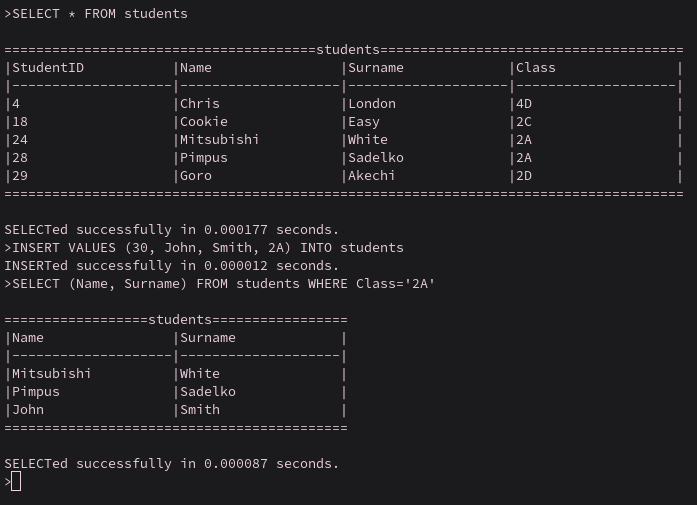

# AptDBMS: A fast DBMS with basic SQL support

This is a DataBase Management System written entirely from scratch in C. My goal was to deepen my understanding of B-trees, the structure underlying modern databases. The program features a basic SQL interpreter that allows the user to interact with a demo database with one table of students. Use basic SQL SEARCH and INSERT instructions to query the database, and enter 'exit' to exit. The software also comes with a function timer, and reaches relatively high performance results. You can load a database from an aptdb file and provide an SQL transaction via an sql file. If a database is not provided, `students.aptdb` is attempted to be loaded. If a transaction is not provided, AptDBMS goes into user interaction console mode. The format is as following: `aptdbms [database] [transaction]`. The repository contains an example `students.aptdb` database and an example `add_and_show.sql` transaction.
